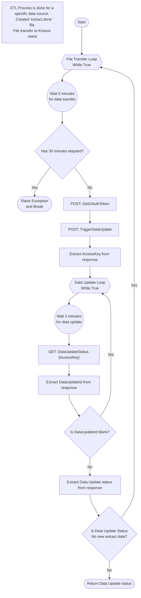

# Trigger Maestro Data Update

This project provides a Python-based solution to trigger and monitor data updates for Maestro. It uses environment variables for configuration and supports integration with CONTROL-M or other schedulers.

## Features

- Triggers data updates for Maestro using REST APIs.
- Monitors the status of the data update process.
- Configurable via environment variables or fallback to local configuration files for testing.
- Logs execution details to a rotating log file.
- Designed for integration with CONTROL-M or other job schedulers.

---

## Prerequisites

- Python 3.8 or higher
- Poetry for dependency management
- CONTROL-M (optional, for scheduling)

---

## Installation

1. Clone the repository:
   ```bash
   git clone <repository-url>
   cd trigger_maestro_data_update
   ```

2. Install dependencies using Poetry:
   ```bash
   poetry install
   ```

3. Create a `.env` file or export the required environment variables (see below).

---

## Configuration

### Environment Variables

The script uses the following environment variables for configuration:

| Variable Name                  | Description                                   | Default (from config.json) |
|--------------------------------|-----------------------------------------------|------------------------------|
| `HOST`                         | Base URL for the Maestro API                 | `"https://example.com"`      |
| `COMPANY_ID`                   | Company ID for the Maestro instance          | `"XXXX01_DEV01"`             |
| `FILE_XFER_WAIT_TIME_MINUTES`  | Wait time for file transfer (in minutes)     | `10`                         |
| `DATA_UPDATE_WAIT_TIME_MINUTES`| Wait time between status checks (in minutes) | `5`                          |
| `MAX_FILE_TRANSFER_TIME_MINUTES`| Maximum allowed file transfer time (minutes)| `60`                         |
| `SAFETY_TIMEOUT_MINUTES`       | Safety timeout for the entire process        | `120`                        |
| `USER_ID`                      | User ID for OAuth authentication             | N/A                          |
| `PASSWORD`                     | Password for OAuth authentication            | N/A                          |

### Local Testing

For local testing, you can use config.json and credentials.json files as fallbacks. These files should be structured as follows:

#### config.json
```json
{
    "HOST": "https://example.com",
    "COMPANY_ID": "XXXX01_DEV01",
    "FILE_XFER_WAIT_TIME_MINUTES": 10,
    "DATA_UPDATE_WAIT_TIME_MINUTES": 5,
    "MAX_FILE_TRANSFER_TIME_MINUTES": 60,
    "SAFETY_TIMEOUT_MINUTES": 120
}
```

#### credentials.json
```json
{
    "USER_ID": "your_user_id",
    "PASSWORD": "your_password"
}
```

---

## Usage

### Running the Script

1. Export the required environment variables:
   ```bash
   export HOST="https://example.com"
   export COMPANY_ID="XXXX01_DEV01"
   export FILE_XFER_WAIT_TIME_MINUTES=10
   export DATA_UPDATE_WAIT_TIME_MINUTES=5
   export MAX_FILE_TRANSFER_TIME_MINUTES=60
   export SAFETY_TIMEOUT_MINUTES=120
   export USER_ID="your_user_id"
   export PASSWORD="your_password"
   ```

2. Run the script:
   ```bash
   poetry run python main.py --data-source <data_source>
   ```

### Using the Shell Script

You can also use the provided shell script for easier execution:
```bash
./run_trigger_data_update.sh <data_source>
```

---

## Logs

Logs are stored in the trigger_data_update.log file. The log file is rotated automatically when it reaches 10 MB, keeping the last 5 log files.

---

## Exit Codes

The script exits with the following codes:

| Exit Code | Description                                   |
|-----------|-----------------------------------------------|
| `0`       | Success                                       |
| `1`       | General error or data update not completed    |
| `2`       | Timeout error                                 |

---

## Integration with CONTROL-M

To integrate with CONTROL-M, use the run_trigger_data_update.sh script as the job command. Ensure all required environment variables are set in the CONTROL-M job definition.

---

## License

This project is licensed under the MIT License. See the `LICENSE` file for details.

---

## Contributing

Contributions are welcome! Please open an issue or submit a pull request for any improvements or bug fixes.

---

This `README.md` provides a comprehensive overview of the project, including setup, configuration, usage, and integration details.

dimorry: go ahead and add this file to the project

GitHub Copilot: The main.py file is already well-structured and ready to be part of the project. To ensure it integrates seamlessly, follow these steps:

---

### Steps to Add main.py to the Project

1. **Place the File**:
   Ensure the main.py file is located in the root of your project directory:
   ```
   trigger_maestro_data_update/main.py
   ```

2. **Verify Dependencies**:
   Ensure all dependencies (`trigger_data_update`, config.json, credentials.json) are present in the same project directory.

3. **Make the File Executable** (Optional):
   If you want to run main.py directly from the terminal, make it executable:
   ```bash
   chmod +x trigger_maestro_data_update/main.py
   ```

4. **Run the Script**:
   Test the script by running it with the required arguments:
   ```bash
   python trigger_maestro_data_update/main.py --data-source <data_source>
   ```

5. **Integrate with the Shell Script**:
   The run_trigger_data_update.sh script already calls main.py. Ensure the environment variables are correctly set in the shell script.

---

### Project Structure After Adding main.py

Your project directory should look like this:

```
trigger_maestro_data_update/
├── main.py
├── trigger_data_update.py
├── oauth.py
├── request.py
├── config.json
├── credentials.json
├── run_trigger_data_update.sh
├── logs/
│   └── trigger_data_update.log
```

---

### Testing

- Run the run_trigger_data_update.sh script to ensure everything works as expected:
  ```bash
  ./run_trigger_data_update.sh <data_source>
  ```

- Check the logs in trigger_data_update.log for any issues.

---

### Architecture Diagram


This diagram illustrates the application flow

---