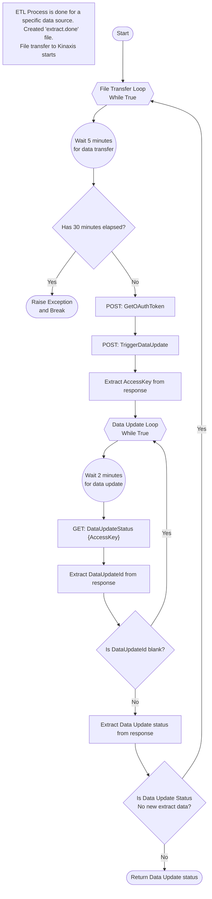

```mermaid
flowchart TD
    A["ETL Process is done for a specific data source. 
    Created 'extract.done' file.<br>File transfer to Kinaxis starts"]
    B(["Start"]) --> C{{"File Transfer Loop<br>While True"}}
    C --> D(("Wait 5 minutes<br>for data transfer"))
    D --> E{"Has 30 minutes elapsed?"}
    E -- Yes --> F(["Raise Exception<br>and Break"])
    E -- No --> G["POST: GetOAuthToken"]
    G --> H["POST: TriggerDataUpdate"]
    H --> I["Extract AccessKey from response"]
    I --> J{{"Data Update Loop<br>While True"}} 
    J --> R(("Wait 2 minutes<br>for data update"))
    R --> K["GET: DataUpdateStatus {AccessKey}"]
    K --> L["Extract DataUpdateId from response"]
    L --> M{"Is DataUpdateId blank?"}
    M -- Yes --> J
    M -- No --> O["Extract Data Update status from response"]
    O --> P{"Is Data Update Status<br>No new extract data?"}
    P -- Yes --> C
    P -- No --> Q(["Return Data Update status"])
    
```